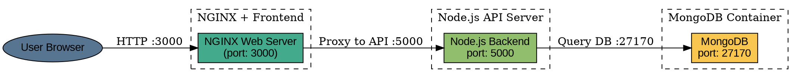
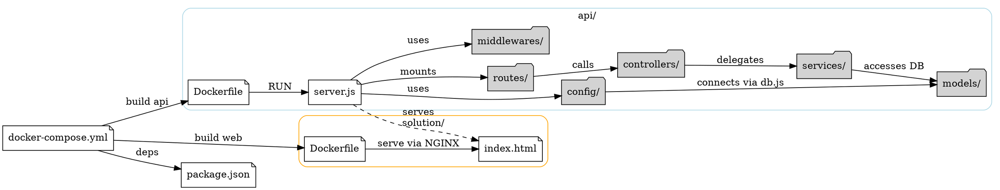

# I. Dockerize ứng dụng RESTful API Banking-Project và tích hợp MongoDB 

Để **Dockerize**  ứng dụng và thay đổi việc lưu dữ liệu từ **in-memory**  sang **MongoDB** , ta sẽ làm các bước sau:

## 🎯 Kiến trúc: MongoDB + Node.js (API) + NGINX (Frontend) 

 
- `MongoDB` (port: `27170`)
 
- `Node.js Backend API` (port: `5000`)
 
- `NGINX` phục vụ frontend (port: `3000`)


---


## ✅ Code sơ đồ kiến trúc (Graphviz DOT format) 




---

## Các bước đưa MongoDB vào ứng dụng

### 🧱 1. Cài đặt thư viện MongoDB 


Chạy:


```bash
npm install mongoose
```


---


### 🔧  2. Sửa code `server.js` để dùng MongoDB
**Thay đổi chính:** 
 
- Kết nối MongoDB bằng `mongoose`
 
- Sử dụng Schema để lưu trữ `Account` và `Transaction`


---


### 📁 Cấu trúc thư mục gợi ý 


```pgsql
7-bank-project/api
├── Dockerfile
├── server.js
├── models/
│   └── Account.js
├── package.json
└── package-lock.json
```


---


### 📦 3. `models/Account.js` – Định nghĩa schema MongoDB

📄 `models/Account.js`
```js
const mongoose = require("mongoose");

const transactionSchema = new mongoose.Schema({
  id: String,
  date: String,
  object: String,
  amount: Number,
});

const accountSchema = new mongoose.Schema({
  user: { type: String, required: true, unique: true },
  currency: String,
  description: String,
  balance: Number,
  transactions: [transactionSchema],
});

const Account = mongoose.model('Account', accountSchema);

module.exports = Account;

```


---


### 🔄 4. Sửa đổi `server.js` để dùng MongoDB thay vì `db`

📄 `server.js`

```js
const express = require("express");
const bodyParser = require("body-parser");
const cors = require("cors");
const mongoose = require("mongoose");
const crypto = require("crypto");
const pkg = require("./package.json");
const Account = require("./models/Account");

// App constants
const port = process.env.PORT || 5000;
const apiPrefix = "/api";

// MongoDB connection
mongoose.connect("mongodb://mongo:27017/budget", {
  useNewUrlParser: true,
  useUnifiedTopology: true,
})
  .then(() => console.log("✅ Connected to MongoDB"))
  .catch((err) => console.error("MongoDB connection error:", err));

// Create Express app
const app = express();
app.use(bodyParser.urlencoded({ extended: true }));
app.use(bodyParser.json());
app.use(cors({ origin: /http:\/\/(127(\.\d){3}|localhost)/ }));
app.options("*", cors());

// Router setup
const router = express.Router();

// Info route
router.get("/", (req, res) => {
  res.send(`${pkg.description} v${pkg.version}`);
});

// Create account
router.post("/accounts", async (req, res) => {
  const { user, currency, description, balance } = req.body;

  if (!user || !currency) {
    return res.status(400).json({ error: "Missing parameters" });
  }

  const exists = await Account.findOne({ user });
  if (exists) {
    return res.status(409).json({ error: "User already exists" });
  }

  const acc = new Account({
    user,
    currency,
    description: description || `${user}'s budget`,
    balance: typeof balance === "number" ? balance : parseFloat(balance) || 0,
    transactions: [],
  });

  await acc.save();
  res.status(201).json(acc);
});

// Get account
router.get("/accounts/:user", async (req, res) => {
  const acc = await Account.findOne({ user: req.params.user });
  if (!acc) {
    return res.status(404).json({ error: "Nhap sai username roi ong oi" });
  }
  res.json(acc);
});

// Delete account
router.delete("/accounts/:user", async (req, res) => {
  const result = await Account.deleteOne({ user: req.params.user });
  if (result.deletedCount === 0) {
    return res.status(404).json({ error: "User does not exist" });
  }
  res.sendStatus(204);
});

// Add transaction
router.post("/accounts/:user/transactions", async (req, res) => {
  const { date, object, amount } = req.body;
  const user = req.params.user;

  if (!date || !object || amount === undefined) {
    return res.status(400).json({ error: "Missing parameters" });
  }

  const acc = await Account.findOne({ user });
  if (!acc) {
    return res.status(404).json({ error: "User does not exist" });
  }

  const amt = typeof amount === "number" ? amount : parseFloat(amount);
  if (isNaN(amt)) {
    return res.status(400).json({ error: "Amount must be a number" });
  }

  const id = crypto
    .createHash("md5")
    .update(date + object + amt)
    .digest("hex");

  if (acc.transactions.some(tx => tx.id === id)) {
    return res.status(409).json({ error: "Transaction already exists" });
  }

  const transaction = { id, date, object, amount: amt };
  acc.transactions.push(transaction);
  acc.balance += amt;

  await acc.save();
  res.status(201).json(transaction);
});

// Delete transaction
router.delete("/accounts/:user/transactions/:id", async (req, res) => {
  const acc = await Account.findOne({ user: req.params.user });
  if (!acc) {
    return res.status(404).json({ error: "User does not exist" });
  }

  const index = acc.transactions.findIndex(tx => tx.id === req.params.id);
  if (index === -1) {
    return res.status(404).json({ error: "Transaction does not exist" });
  }

  const removed = acc.transactions.splice(index, 1)[0];
  acc.balance -= removed.amount;

  await acc.save();
  res.sendStatus(204);
});

// Add API prefix
app.use(apiPrefix, router);

// Start server
app.listen(port, () => {
  console.log(`🚀 Server listening on port ${port}`);
});
```

---


### 5. Dockerize ứng dụng
Để **Dockerize cả frontend (HTML tĩnh)**  và **backend (Node.js)** , ta cần tạo:
 
- Một Dockerfile cho backend trong `7-bank-project/api`
 
- Một Dockerfile cho frontend trong `7-bank-project/solution`
 
- Một file `docker-compose.yml` tại thư mục gốc `7-bank-project` để chạy cả hai dịch vụ


---


### 📁 Cấu trúc thư mục: 


```pgsql
7-bank-project/
├── api/
│   ├── server.js
│   └── package.json
│   └── Dockerfile
├── solution/
│   ├── index.html
│   └── Dockerfile
└── docker-compose.yml
```


---


📦 `api/Dockerfile` (backend: Node.js)


```Dockerfile
# Sử dụng NodeJS base image
FROM node:18

# Tạo thư mục làm việc
WORKDIR /usr/src/app

# Sao chép package.json trước để cài đặt phụ thuộc
COPY package*.json ./

# Cài đặt các phụ thuộc
RUN npm install

# Sao chép toàn bộ mã nguồn vào container
COPY . .

# Mở port (giả sử backend chạy cổng 3000)
EXPOSE 3000

# Lệnh chạy ứng dụng
CMD ["node", "server.js"]
```


---


🌐 `solution/Dockerfile` (frontend: HTML tĩnh)


```Dockerfile
# Sử dụng image nginx để chạy static website
FROM nginx:alpine

# Xóa cấu hình mặc định của nginx
RUN rm -rf /usr/share/nginx/html/*

# Copy file HTML vào nginx html folder
COPY . /usr/share/nginx/html

# Mặc định nginx chạy cổng 80
EXPOSE 80
```


---


🧱 `docker-compose.yml`


```yaml
version: "3"
services:
  app:
    build: ./api
    ports:
      - "5000:5000"
    environment:
      - PORT=5000
      - MONGO_URL=mongodb://mongo:27017/mydb  # Cập nhật URI nếu backend dùng Mongo
    depends_on:
      - mongo

  mongo:
    image: mongo:6
    ports:
      - "27017:27017"
    volumes:
      - mongo-data:/data/db

  frontend:
    build: ./solution
    ports:
      - "8080:80"
    container_name: frontend
    restart: unless-stopped

volumes:
  mongo-data:
```


---


### ▶️ Cách chạy: 

Tại thư mục `my-project`, bạn chạy lệnh:


```bash
docker-compose up --build
```


---


##  Phân tích kiến trúc ứng dụng 

🏗️ **Tổng quan kiến trúc ứng dụng** 
Ứng dụng của bạn là một dịch vụ **RESTful API**  đơn giản để **quản lý tài khoản người dùng và giao dịch tài chính** , được xây dựng với các thành phần chính:
| Thành phần | Công nghệ sử dụng | 
| --- | --- | 
| Web Framework | Express.js | 
| Middleware | body-parser, cors | 
| Cơ sở dữ liệu | MongoDB (kết nối qua mongoose) | 
| Dockerization | Dockerfile, docker-compose.yml | 


---


🔄 **Luồng hoạt động chính** 
 
2. **Khởi động ứng dụng** :
 
  - Express server khởi chạy tại `PORT=5000`.
 
  - Kết nối MongoDB bằng `mongoose.connect()` đến `mongodb://mongo:27017/budget`.
 
4. **API Prefix** :
 
  - Tất cả các route được prefix bằng `/api`, ví dụ: `/api/accounts`.
 
6. **Quản lý tài khoản** :
 
  - `POST /api/accounts`: Tạo mới tài khoản.
 
  - `GET /api/accounts/:user`: Truy vấn thông tin tài khoản.
 
  - `DELETE /api/accounts/:user`: Xóa tài khoản.
 
8. **Quản lý giao dịch tài chính** :
 
  - `POST /api/accounts/:user/transactions`: Thêm giao dịch (transaction).
 
  - `DELETE /api/accounts/:user/transactions/:id`: Xóa giao dịch.
 


---


🧱 **Kiến trúc lớp (đơn giản)** 
| Lớp | Vai trò | 
| --- | --- | 
| server.js | Entry point, định nghĩa routes, xử lý logic ứng dụng | 
| models/account.js |Chứa schema Mongoose cho Account model | 

Ứng dụng chưa chia riêng các **layer**  như `service`, `controller`, `repository`, nên logic còn nằm tập trung trong `server.js`.


---

🧠 **Mô hình dữ liệu ** 


```js
Account = {
  user: String,
  currency: String,
  description: String,
  balance: Number,
  transactions: [
    {
      id: String,
      date: String,
      object: String,
      amount: Number
    }
  ]
}
```


---


🔗 **Kiến trúc kết nối dịch vụ (trong Docker)** 


```plaintext
[ MongoDB Container ]
              ↑
              │
     (Mongoose, port 27017)
              │
[ Node.js Backend (Express) ]
              ↑
              │
      (REST API, port 5000)
              ↑
              │
      [ Nginx - port 3000 ]
         serve frontend
```

 
- Backend dùng hostname `mongo` để kết nối DB vì `docker-compose` cung cấp sẵn DNS nội bộ.
 
- Frontend (HTML/JS) sẽ gửi request đến `http://localhost:5000/api/...` hoặc thông qua reverse proxy của `nginx`.


---


# II. Nâng cấp kiến trúc sử dụng MVC + Service Layer


📌 Ta cần  thiết kế lại **kiến trúc ứng dụng Node.js + MongoDB**   theo hướng chuẩn hóa, rõ ràng hơn theo **MVC + Service Layer** , dễ bảo trì, test và mở rộng:

---

🧱 **Kiến trúc chuẩn hóa ** 


```perl
my-project/
├── api/                      # Backend
│   ├── server.js             # Điểm vào chính của ứng dụng
│   ├── config/
│   │   └── db.js             # Kết nối MongoDB
│   ├── models/
│   │   └── account.model.js  # Mongoose model
│   ├── controllers/
│   │   └── account.controller.js # Xử lý HTTP request
│   ├── services/
│   │   └── account.service.js    # Logic nghiệp vụ
│   ├── routes/
│   │   └── account.routes.js     # Khai báo routes
│   └── middlewares/         # (Tùy chọn) xử lý lỗi, auth
│       └── errorHandler.js
├── solution/                # Frontend tĩnh (HTML/CSS/JS)
│   └── index.html
├── Dockerfile
├── docker-compose.yml
└── package.json
```


---


## 📂 Giải thích chi tiết vai trò các phần 

1. `server.js` – Khởi tạo ứng dụng phía backend:

```js
const express = require("express");
const cors = require("cors");
const bodyParser = require("body-parser");
const connectDB = require("./config/db");
const accountRoutes = require("./routes/account.routes");
const pkg = require("./package.json");

// Init app
const app = express();
const port = process.env.PORT || 5000;

// Connect DB
connectDB();

// Middleware
app.use(cors({ origin: /http:\/\/(localhost|127\.0\.0\.1)/ }));
app.use(bodyParser.json());
app.use(bodyParser.urlencoded({ extended: true }));

// Routes
app.get("/api", (req, res) => {
  res.send(`${pkg.description} v${pkg.version}`);
});
app.use("/api", accountRoutes);

// Start server
app.listen(port, () => {
  console.log(`🚀 Server listening on port ${port}`);
});
```


---


2. `config/db.js` – cấu hình kết nối MongoDB


```js
const mongoose = require("mongoose");

const connectDB = async () => {
  try {
    await mongoose.connect("mongodb://mongo:27017/budget", {
      useNewUrlParser: true,
      useUnifiedTopology: true,
    });
    console.log("✅ Connected to MongoDB");
  } catch (err) {
    console.error("❌ MongoDB connection error:", err.message);
    process.exit(1);
  }
};

module.exports = connectDB;

```


---


3. `models/account.model.js` – định nghĩa schema


```js
const mongoose = require("mongoose");

const transactionSchema = new mongoose.Schema({
  id: String,
  date: String,
  object: String,
  amount: Number,
});

const accountSchema = new mongoose.Schema({
  user: { type: String, required: true, unique: true },
  currency: { type: String, required: true },
  description: String,
  balance: Number,
  transactions: [transactionSchema],
});

const Account = mongoose.model('Account', accountSchema);

module.exports = Account;


```


---


4. `services/account.service.js` – xử lý logic nghiệp vụ


```js
const Account = require("../models/account.model");
const crypto = require("crypto");

const createAccount = async ({ user, currency, description, balance }) => {
  const exists = await Account.findOne({ user });
  if (exists) throw new Error("User already exists");

  const acc = new Account({
    user,
    currency,
    description: description || `${user}'s budget`,
    balance: parseFloat(balance) || 0,
    transactions: [],
  });

  return acc.save();
};

const getAccount = async (user) => {
  return Account.findOne({ user });
};

const deleteAccount = async (user) => {
  return Account.deleteOne({ user });
};

const addTransaction = async (user, { date, object, amount }) => {
  const acc = await Account.findOne({ user });
  if (!acc) throw new Error("User not found");

  const amt = parseFloat(amount);
  if (isNaN(amt)) throw new Error("Invalid amount");

  const id = crypto.createHash("md5").update(date + object + amt).digest("hex");

  if (acc.transactions.some((tx) => tx.id === id)) {
    throw new Error("Transaction already exists");
  }

  const transaction = { id, date, object, amount: amt };
  acc.transactions.push(transaction);
  acc.balance += amt;

  await acc.save();
  return transaction;
};

const deleteTransaction = async (user, id) => {
  const acc = await Account.findOne({ user });
  if (!acc) throw new Error("User not found");

  const index = acc.transactions.findIndex((tx) => tx.id === id);
  if (index === -1) throw new Error("Transaction not found");

  const [removed] = acc.transactions.splice(index, 1);
  acc.balance -= removed.amount;

  await acc.save();
};

module.exports = {
  createAccount,
  getAccount,
  deleteAccount,
  addTransaction,
  deleteTransaction,
};
```


---


5. `controllers/account.controller.js` – xử lý request/response


```js
const service = require("../services/account.service");

exports.create = async (req, res) => {
  try {
    const acc = await service.createAccount(req.body);
    res.status(201).json(acc);
  } catch (err) {
    res.status(400).json({ error: err.message });
  }
};

exports.get = async (req, res) => {
  const acc = await service.getAccount(req.params.user);
  if (!acc) return res.status(404).json({ error: "User not found" });
  res.json(acc);
};

exports.delete = async (req, res) => {
  const result = await service.deleteAccount(req.params.user);
  if (result.deletedCount === 0) {
    return res.status(404).json({ error: "User not found" });
  }
  res.sendStatus(204);
};

exports.addTransaction = async (req, res) => {
  try {
    const tx = await service.addTransaction(req.params.user, req.body);
    res.status(201).json(tx);
  } catch (err) {
    res.status(400).json({ error: err.message });
  }
};

exports.deleteTransaction = async (req, res) => {
  try {
    await service.deleteTransaction(req.params.user, req.params.id);
    res.sendStatus(204);
  } catch (err) {
    res.status(404).json({ error: err.message });
  }
};
```


---


6. `routes/account.routes.js` – định nghĩa API


```js
const express = require("express");
const router = express.Router();
const controller = require("../controllers/account.controller");

router.post("/accounts", controller.create);
router.get("/accounts/:user", controller.get);
router.delete("/accounts/:user", controller.delete);
router.post("/accounts/:user/transactions", controller.addTransaction);
router.delete("/accounts/:user/transactions/:id", controller.deleteTransaction);

module.exports = router;
```


---


## 🔧 Dockerize ứng dụng  
SV tự viết


---


## ✅ Lợi ích của kiến trúc chuẩn hóa 

 
- ✅ Dễ **quản lý mã nguồn**
 
- ✅ Tách biệt rõ **logic, dữ liệu và controller**
 
- ✅ Thuận tiện **unit test từng lớp**
 
- ✅ Dễ mở rộng, bảo trì
 
- ✅ Có thể tích hợp **middleware** , logging, JWT, swagger dễ dàng


---



# III. Cài đặt Swagger cho ứng dụng
### 1. Cài đặt Swagger UI và Swagger JSdoc 


Đầu tiên, chúng ta cần cài đặt hai gói chính để tích hợp Swagger vào ứng dụng:

 
- **swagger-ui-express** : Gói này giúp chúng ta hiển thị Swagger UI trong ứng dụng Node.js.
 
- **swagger-jsdoc** : Gói này sẽ tự động sinh ra tài liệu API từ các comment trong mã nguồn.


Thêm vào `package.json` của bạn trong phần `dependencies`:


```json
"dependencies": {
  
   "swagger-ui-express": "^4.6.3",
    "swagger-jsdoc": "^6.2.8",
}
```

Sau đó, chạy lệnh `npm install` để cài đặt các gói.

### 2. Cấu hình Swagger trong ứng dụng Node.js 


Sau khi cài đặt xong, bạn cần cấu hình Swagger để sinh ra tài liệu API từ các comment trong mã nguồn.

Tạo một file cấu hình Swagger  `swagger.js` trong thư mục `config`:


```javascript
// config/swagger.js

const swaggerJSDoc = require('swagger-jsdoc');

const options = {
  definition: {
    openapi: '3.0.0',
    info: {
      title: '7 Bank Project API',
      version: '1.0.0',
      description: 'API documentation for 7 Bank Project backend',
    },
    servers: [
      {
        url: 'http://localhost:5000/api',
      },
    ],
  },
  apis: ['./routes/*.js'], // chỉ định file chứa swagger annotations
};

const swaggerSpec = swaggerJSDoc(options);

module.exports = swaggerSpec;

```


### 3. Tạo các Comment Swagger cho các API 

Trong các file route của ứng dụng, bạn cần thêm các comment Swagger để mô tả các API. Mỗi route cần được chú thích với các thông tin Swagger như mô tả API, các tham số đầu vào, và các response có thể có.

#### 🔧 `routes/account.routes.js` 


```js

const express = require("express");
const router = express.Router();
const accountController = require("../controllers/account.controller");

/**
 * @swagger
 * /accounts:
 *   post:
 *     summary: Tạo tài khoản mới
 *     tags: [Accounts]
 *     requestBody:
 *       required: true
 *       content:
 *         application/json:
 *           schema:
 *             type: object
 *             properties:
 *               user:
 *                 type: string
 *               currency:
 *                 type: string
 *               description:
 *                 type: string
 *               balance:
 *                 type: number
 *     responses:
 *       201:
 *         description: Tài khoản đã được tạo thành công
 */
router.post("/accounts", accountController.create);

/**
 * @swagger
 * /accounts/{user}:
 *   get:
 *     summary: Lấy thông tin tài khoản
 *     tags: [Accounts]
 *     parameters:
 *       - in: path
 *         name: user
 *         required: true
 *         schema:
 *           type: string
 *     responses:
 *       200:
 *         description: Thông tin tài khoản
 */
router.get("/accounts/:user", accountController.get);

/**
 * @swagger
 * /accounts/{user}:
 *   delete:
 *     summary: Xóa tài khoản
 *     tags: [Accounts]
 *     parameters:
 *       - in: path
 *         name: user
 *         required: true
 *         schema:
 *           type: string
 *     responses:
 *       204:
 *         description: Đã xóa thành công
 */
router.delete("/accounts/:user", accountController.delete);

/**
 * @swagger
 * /accounts/{user}/transactions:
 *   post:
 *     summary: Thêm giao dịch mới
 *     tags: [Transactions]
 *     parameters:
 *       - in: path
 *         name: user
 *         required: true
 *         schema:
 *           type: string
 *     requestBody:
 *       required: true
 *       content:
 *         application/json:
 *           schema:
 *             type: object
 *             properties:
 *               date:
 *                 type: string
 *               object:
 *                 type: string
 *               amount:
 *                 type: number
 *     responses:
 *       201:
 *         description: Giao dịch đã thêm thành công
 */
router.post("/accounts/:user/transactions", accountController.addTransaction);

/**
 * @swagger
 * /accounts/{user}/transactions/{id}:
 *   delete:
 *     summary: Xóa giao dịch
 *     tags: [Transactions]
 *     parameters:
 *       - in: path
 *         name: user
 *         required: true
 *         schema:
 *           type: string
 *       - in: path
 *         name: id
 *         required: true
 *         schema:
 *           type: string
 *     responses:
 *       204:
 *         description: Giao dịch đã được xóa
 */
router.delete("/accounts/:user/transactions/:id", accountController.deleteTransaction);

module.exports = router;


```

### 4. Thiết lập Swagger UI 

Mở file `server.js` nơi cấu hình express, tích hợp Swagger UI vào ứng dụng:

#### `server.js`
```js

  // 

  const express = require("express");
  const cors = require("cors");
  const bodyParser = require("body-parser");
  const connectDB = require("./config/db");
  const accountRoutes = require("./routes/account.routes");
  const pkg = require("./package.json");

  // 📄 Swagger:
  const swaggerUi = require("swagger-ui-express");
  const swaggerSpec = require("./config/swagger");

  // Initialize app
  const app = express();
  const port = process.env.PORT || 5000;

  // Connect to MongoDB
  connectDB();

  // Middleware
  app.use(cors({ origin: /http:\/\/(localhost|127\.0\.0\.1)/ }));
  app.use(bodyParser.json());
  app.use(bodyParser.urlencoded({ extended: true }));

  // Swagger API Docs
  app.use("/api-docs", swaggerUi.serve, swaggerUi.setup(swaggerSpec));

  // Health Check or Base API info
  app.get("/api", (req, res) => {
    res.json({
      name: pkg.name,
      version: pkg.version,
      description: pkg.description,
      author: pkg.author,
    });
  });

  // Main API routes
  app.use("/api", accountRoutes);

  // 404 Handler (optional)
  app.use((req, res, next) => {
    res.status(404).json({ error: "Not Found" });
  });

  // Global Error Handler (optional)
  app.use((err, req, res, next) => {
    console.error(err.stack);
    res.status(500).json({ error: "Internal Server Error" });
  });

  // Start server
  app.listen(port, () => {
    console.log(`🚀 Server is running at http://localhost:${port}`);
  });


```

Khi bạn chạy ứng dụng, Swagger UI sẽ có sẵn tại `http://localhost:5000/api-docs`, nơi bạn có thể xem tài liệu API và thử nghiệm các endpoints trực tiếp.


### 5. Chạy lại Docker 


Sau khi thêm Swagger vào dự án, bạn cần rebuild lại Docker containers để áp dụng các thay đổi. Chạy lệnh sau:


```bash
docker-compose down
docker-compose up --build
```


### 6. Kiểm tra API Docs 

Khi ứng dụng đã chạy, có thể mở trình duyệt và truy cập vào Swagger UI tại http://localhost:5000/api-docs để xem tài liệu API. Tại đây, ta cũng có thể thử nghiệm các API thông qua giao diện Swagger UI.


# IV. Nhúng Xác Thực JWT Vào Ứng Dụng Node.js 

Trong phần này, chúng ta sẽ thực hiện các bước sau:

 
1. Cài đặt các gói cần thiết.
 
2. Cấu hình JWT và các middleware xác thực.
 
3. Thêm biến môi trường trong `.env` để bảo mật.
 
4. Cập nhật `Dockerfile` và `docker-compose.yml` để sử dụng Docker mà không cần phải chạy `npm install` thủ công.


---


## **1. Cài Đặt Các Gói và Tạo Các Folders/Files Cần Thiết** 

Các gói sau sẽ được sử dụng trong ứng dụng của bạn:

 
- **bcryptjs** : Dùng để mã hóa và kiểm tra mật khẩu.
 
- **dotenv** : Để sử dụng biến môi trường.
 
- **express** : Framework web cho Node.js.
 
- **jsonwebtoken** : Thư viện tạo và xác minh JSON Web Tokens.
 
- **mongoose** : Thư viện để tương tác với MongoDB.
 
- **cors** : Dùng để xử lý các yêu cầu từ các nguồn khác (CORS).
 
- **body-parser** : Dùng để phân tích các yêu cầu từ body.
 
- **swagger-ui-express** : Dùng để tạo tài liệu API với Swagger.

### Cập Nhật File `package.json`** 
Dưới đây là các gói dependencies cho `package.json` :


```json
{
  ...
  "dependencies": {
    "body-parser": "^1.20.1",
    "cors": "^2.8.5",
    "express": "^4.19.2",    
    "mongoose": "^8.14.0",
    "swagger-ui-express": "^4.6.3",
    "swagger-jsdoc": "^6.2.8",
    "jsonwebtoken": "^9.0.0",
    "bcryptjs": "^2.4.3",
    "dotenv": "^10.0.0"
  },
  ...
}
```
### **Bổ sung các file và thư mục**

- Tạo thư mục `auth` và các file bên trong để quản lý các API liên quan xác thực
- Tạo file `auth.js` trong thư mục middleware cho phương thức xác thực
- Tạo file `.env` trong thư mục gốc của dự án để lưu biến môi trường (khóa bí mật)
```perl
my-project/
├── api/                          # Backend
│   ├── server.js                 # Điểm vào chính
│   ├── config/
│   │   ├── db.js                 # Kết nối MongoDB
│   │   └── swagger.js           # Cấu hình Swagger
│   ├── models/
│   │   └── account.model.js      # Mongoose model
│   ├── controllers/
│   │   └── account.controller.js # Xử lý HTTP request
│   ├── services/
│   │   └── account.service.js    # Logic nghiệp vụ
│   ├── routes/
│   │   └── account.routes.js     # Khai báo các route liên quan đến account
│   ├── middlewares/
│   │   ├── auth.js               # Middleware xác thực JWT
│   │   └── errorHandler.js       # Xử lý lỗi
│   └── auth/
│   │   ├── auth.controller.js    # Controller cho auth
│   │   ├── auth.service.js       # Business logic cho auth
│   │   ├── auth.routes.js        # Định nghĩa các route /auth
│   └── package.json              # Định nghia các gói phụ thuộc của Backend
│   └── Dockerfile                # Đóng docker file của Backend
├── solution/                    # Frontend tĩnh (HTML/CSS/JS)
│   ├── index.html
│   ├── scripts.js
│   └── Dockerfile
├── docker-compose.yml
└── .env                          # Biến môi trường (ví dụ: JWT_SECRET)


```

## 2. Cấu Hình Môi Trường và Biến JWT_SECRET 
Trong thư mục gốc của project, tạo một tệp `.env` để chứa các biến môi trường của bạn, bao gồm khóa bí mật của JWT.
**Tạo File `.env`** 


```env
JWT_SECRET=my_super_secret_key_123  # Khóa bí mật JWT
```

## 3. Chỉnh sửa  file `models/account.model.js` để bổ sung thuộc tính `password`

```javascript
//models/account.js

const mongoose = require("mongoose");

const transactionSchema = new mongoose.Schema({
  id: String,
  date: String,
  object: String,
  amount: Number,
});

const accountSchema = new mongoose.Schema({
  user: { type: String, required: true, unique: true },
  password: { type: String, required: false, select: false },
  currency: { type: String, required: true },
  description: String,
  balance: Number,
  transactions: [transactionSchema],
});

accountSchema.set("toJSON", {
  transform: (doc, ret) => {
    delete ret.password;
    return ret;
  }
});

const Account = mongoose.model('Account', accountSchema);

module.exports = Account;

```


## 4. Tạo Xác Thực JWT trong folder `auth/` 

### a. Dịch vụ xác thực `auth/auth.service.js`
Nội dung file `auth/auth.service.js` để xử lý việc đăng ký, đăng nhập và tạo token JWT. 


```javascript
//auth/auth.service.js

const bcrypt = require("bcryptjs");
const jwt = require("jsonwebtoken");
const Account = require("../models/account.model");

// Dùng biến môi trường cho SECRET_KEY để bảo mật
const SECRET_KEY = process.env.JWT_SECRET || "default_secret_key";

const register = async ({ user, password, currency, description = "", balance = 0 }) => {
  // Kiểm tra user đã tồn tại chưa
  const existing = await Account.findOne({ user });
  if (existing) {
    throw new Error("User already exists");
  }

  const hashedPassword = await bcrypt.hash(password, 10);
  const account = new Account({
    user,
    password: hashedPassword,
    currency,
    description,
    balance,
    transactions: [],
  });

  await account.save();
  return { message: "User registered successfully" };
};

const login = async ({ user, password }) => {
  // Lấy user và bao gồm trường password
  const account = await Account.findOne({ user }).select("+password");
  if (!account) {
    throw new Error("Invalid username or password");
  }

  const isMatch = await bcrypt.compare(password, account.password);
  if (!isMatch) {
    throw new Error("Invalid username or password");
  }

  const token = jwt.sign({ user }, SECRET_KEY, { expiresIn: "1h" });
  return { token };
};

const verifyToken = (token) => {
  return jwt.verify(token, SECRET_KEY);
};

module.exports = { register, login, verifyToken };

```

### b. Controller xác thực `auth/auth.controller.js`
Nội dung file `auth/auth.controller.js` để điều khiển việc đăng ký, đăng nhập.

```javascript

//auth/auth.controller.js

const authService = require("./auth.service");

const register = async (req, res, next) => {
  try {
    await authService.register(req.body);
    res.status(201).send({ message: "User registered" });
  } catch (err) {
    res.status(400).send({ error: err.message });
  }
};

const login = async (req, res, next) => {
  try {
    const { token } = await authService.login(req.body);
    res.send({ token });
  } catch (err) {
    res.status(401).send({ error: err.message });
  }
};

module.exports = { register, login };

```
### c. Routing xác thực `auth/auth.routes.js` 
Nội dung file `auth/auth.routes.js` để điều hướng request về đăng ký, đăng nhập.

```javascript
//auth/auth.routes.js

const express = require("express");
const router = express.Router();
const controller = require("./auth.controller");
// Có thể bổ sung Swagger
router.post("/register", controller.register);
router.post("/login", controller.login);

module.exports = router;


```

## **5. Tạo Middleware Xác Thực JWT** 
Tạo một middleware để xác minh token JWT trong các yêu cầu của người dùng. Đảm bảo rằng middleware này sẽ kiểm tra token trong header `Authorization`.
File `auth.js` trong `middlewares/`** 


```javascript
//middlewares/auth.js

const jwt = require("jsonwebtoken");

module.exports = (req, res, next) => {
  const authHeader = req.headers["authorization"];
  console.log("Authorization header:", authHeader);  // Kiểm tra giá trị header

  const token = authHeader && authHeader.split(" ")[1]; // Bearer <token>
  console.log("Token:", token);  // Kiểm tra token

  if (!token) return res.status(401).json({ error: "Token required" });

  try {
    const decoded = jwt.verify(token, process.env.JWT_SECRET);
    req.user = decoded; // Gán thông tin người dùng vào request
    next();
  } catch (err) {
    console.log(err);  // In lỗi chi tiết ra console để kiểm tra thêm
    res.status(403).json({ error: "Invalid or expired token" });
  }
};


```

### 6. Cập nhật routes để bảo vệ các API

Đảm bảo rằng các route yêu cầu xác thực được bảo vệ bởi middleware xác thực JWT.

Chỉnh sửa `routes/account.route.js` để bảo vệ các API: Thêm phương thức xác thực vào các router, ví dụ
```js
const auth = require("../middlewares/auth");
...
router.post("/accounts", auth, accountController.create);
router.get("/accounts/:user", auth, accountController.get);

```

Nội dung đầy đủ của `routes/account.route.js` 

```javascript

//routes/account.route.js

const express = require("express");
const router = express.Router();
const accountController = require("../controllers/account.controller");
const auth = require("../middlewares/auth");

// Áp dụng middleware xác thực cho tất cả các route bên dưới
//router.use(auth);
/**
 * @swagger
 * /accounts:
 *   post:
 *     summary: Tạo tài khoản mới
 *     tags: [Accounts]
 *     requestBody:
 *       required: true
 *       content:
 *         application/json:
 *           schema:
 *             type: object
 *             properties:
 *               user:
 *                 type: string
 *               currency:
 *                 type: string
 *               description:
 *                 type: string
 *               balance:
 *                 type: number
 *     responses:
 *       201:
 *         description: Tài khoản đã được tạo thành công
 */
//Bảo vệ phương thức POST accounts bằng auth;
router.post("/accounts", auth, accountController.create);
/**
 * @swagger
 * /accounts/{user}:
 *   get:
 *     summary: Lấy thông tin tài khoản
 *     tags: [Accounts]
 *     parameters:
 *       - in: path
 *         name: user
 *         required: true
 *         schema:
 *           type: string
 *     responses:
 *       200:
 *         description: Thông tin tài khoản
 */
//Bảo vệ phương thức GET accounts bằng auth;
router.get("/accounts/:user", auth, accountController.get);
/**
 * @swagger
 * /accounts/{user}:
 *   delete:
 *     summary: Xóa tài khoản
 *     tags: [Accounts]
 *     parameters:
 *       - in: path
 *         name: user
 *         required: true
 *         schema:
 *           type: string
 *     responses:
 *       204:
 *         description: Đã xóa thành công
 */
router.delete("/accounts/:user", accountController.delete);

/**
 * @swagger
 * /accounts/{user}/transactions:
 *   post:
 *     summary: Thêm giao dịch mới
 *     tags: [Transactions]
 *     parameters:
 *       - in: path
 *         name: user
 *         required: true
 *         schema:
 *           type: string
 *     requestBody:
 *       required: true
 *       content:
 *         application/json:
 *           schema:
 *             type: object
 *             properties:
 *               date:
 *                 type: string
 *               object:
 *                 type: string
 *               amount:
 *                 type: number
 *     responses:
 *       201:
 *         description: Giao dịch đã thêm thành công
 */
router.post("/accounts/:user/transactions", accountController.addTransaction);

/**
 * @swagger
 * /accounts/{user}/transactions/{id}:
 *   delete:
 *     summary: Xóa giao dịch
 *     tags: [Transactions]
 *     parameters:
 *       - in: path
 *         name: user
 *         required: true
 *         schema:
 *           type: string
 *       - in: path
 *         name: id
 *         required: true
 *         schema:
 *           type: string
 *     responses:
 *       204:
 *         description: Giao dịch đã được xóa
 */
router.delete("/accounts/:user/transactions/:id", accountController.deleteTransaction);

module.exports = router;

```
### 7. Cập nhật `server.js`

```js
// server.js

require("dotenv").config();
const express = require("express");
const cors = require("cors");
const bodyParser = require("body-parser");
const swaggerUi = require("swagger-ui-express");

const connectDB = require("./config/db");
const swaggerSpec = require("./config/swagger");
const accountRoutes = require("./routes/account.routes");
const authRoutes = require("./auth/auth.routes");
const pkg = require("./package.json");

// Initialize app
const app = express();
const port = process.env.PORT || 5000;

// Connect to MongoDB
connectDB();

// Middleware
app.use(cors({ origin: /http:\/\/(localhost|127\.0\.0\.1)/ }));
app.use(bodyParser.json());
app.use(bodyParser.urlencoded({ extended: true }));

// Swagger API Docs
app.use("/api-docs", swaggerUi.serve, swaggerUi.setup(swaggerSpec));
// Nếu dùng YAML: app.use('/api-docs', swaggerUi.serve, swaggerUi.setup(require('./docs/swagger.yaml')));

// Health Check or Base API info
app.get("/api", (req, res) => {
  res.json({
    name: pkg.name,
    version: pkg.version,
    description: pkg.description,
    author: pkg.author,
  });
});

// Main API routes
app.use("/api", accountRoutes);
app.use("/api/auth", authRoutes);

// 404 Handler
app.use((req, res, next) => {
  res.status(404).json({ error: "Not Found" });
});

// Global Error Handler
app.use((err, req, res, next) => {
  console.error(err.stack);
  res.status(500).json({ error: "Internal Server Error" });
});

// Start server
app.listen(port, () => {
  console.log(`🚀 Server is running at http://localhost:${port}`);
});


```


###  8. Cập nhật file Docker Compose

Cập nhật file `docker-compose.yml` để nhận biến môi trường


```yaml
version: "3"
services:
  app:
    build: ./api
    ports:
      - "5000:5000"
    env_file:
      - .env  # Chỉ định tệp .env mà Docker sẽ sử dụng
    environment:
      - PORT=5000
      - MONGO_URL=mongodb://mongo:27017/mydb  # Cập nhật URI nếu backend dùng Mongo
    depends_on:
      - mongo

  mongo:
    image: mongo:6
    ports:
      - "27017:27017"
    volumes:
      - mongo-data:/data/db

  frontend:
    build: ./solution
    ports:
      - "3000:80"
    container_name: frontend
    restart: unless-stopped

volumes:
  mongo-data:


```

### 9. Build ứng dụng và Chạy Docker

Sử dụng Docker Compose để xây dựng và chạy ứng dụng.


```bash
docker-compose up --build
```


---


### 10. Test API Với Postman

Để kiểm tra các API của bạn bằng Postman, hãy làm theo các bước sau:

 
2. Đăng ký người dùng qua API `POST /api/auth/register` với body chứa thông tin người dùng.
 
4. Đăng nhập qua API `POST /api/auth/login` để nhận token.
 
6. Sử dụng token trong header `Authorization` với kiểu Bearer Token khi gọi các API bảo mật (ví dụ: `GET /api/accounts/testuser`).

Trong header, chọn loại là **Bearer Token**  và dán token vào.


---


**Kết Luận** 
Với hướng dẫn này, bạn đã có thể tích hợp xác thực JWT vào ứng dụng Node.js của mình, bảo vệ các API bằng cách sử dụng middleware và cấu hình Docker để tự động cài đặt phụ thuộc mà không cần phải chạy `npm install`.
